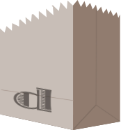

# databag

  - a lame attempt at a daemonless nosql db

  - secretly, it's a schemaless wrapper on top of sqlite

---

## ok, why?

  - tiny VMs are cheap and ubiquitous
  - do you know how much ram an aws micro has?
  - also, i'm not cool enough to use heroku
  - I don't need a full blown db process hogging resources
  - deployment is a self contained virtualenv, then splat a flat file in
    place

  - has numerous use cases beyond frugal hosting if you consider transient
    compute nodes, collection nodes, queue based parallelization...

---

## no, really. why this?

  - sqlite is solid... but, i'm a fan of nosql.
  - it's pythonic and simple to use.
  - makes data persistence crazy easy
  - offers versioning of data if you want it
  - transparently compresses (bz2) data as it goes in when useful to minimize
    growth of raw file
  - other reasons that are awesome

---

## are there alternatives?

couldn't find a good pure py, but cross language, nosqlish flat file db

  - pickle?  no.
  - json to text? ha.
  - tokyo cabinet? really?!
  - &lt;insert whatever else here&gt;? maybe...

(note, goatfish... but I didn't like the query options)

---

# So tell me... what does a dbag look like?

---

## what were you expecting?

    !pycon
    >>> from databag import DataBag
    >>> d = DataBag(fpath='/tmp/mybag')
    >>> d.add('asdfasdf')
    '57efgS2jKc8bp4pje5pgaW'
    >>> d[_]
    u'asdfasdf'
    >>> d.add({'name':'jeremy'})
    '9rmcDpK7FTwQR8jMj2tcoC'
    >>> d[_]
    {u'name': u'jeremy'}

---

# But what about DictBags?

In databag, the really useful stuff is a funly class named DictBag.

  - dictbag
  - DictBAG
  - DICTBAG

Silly name, but really powerful.

---

# mainly, I just like saying dictbag

---

## How about this?

    !pycon
    >>> from databag import DictBag, Q
    >>> d = DictBag()
    >>> d.ensure_index( ('name','age') )
    >>> d.add( {'name': 'joe', 'age': 23} )
    '6xDZzTgccXCRLdp4ADjxaa'
    >>> d.add( {'name': 'jill', 'age': 50} )
    '73B5oGX5yFm4GWWpl1pzxg'
    >>> d['73B5oGX5yFm4GWWpl1pzxg']
    {u'age': 50, u'name': u'jill'}

---

## HOW ABOUT SOME QUERIES!

    !pycon
    >>> d.find(name='jill')
    <generator object <genexpr> at 0x109f9b320>

    >>> d.find(name='jill').next()
    (u'73B5oGX5yFm4GWWpl1pzxg', {u'age': 50, u'name': u'jill'})

    >>> d.find(Q('age')>40).next()
    (u'73B5oGX5yFm4GWWpl1pzxg', {u'age': 50, u'name': u'jill'})

    >>> for k, rec in d.find(1<Q('age')<60):
    ...   print k, rec
    XCRLdp4ADjxaa {u'age': 23, u'name': u'joe'}
    73B5oGX5yFm4GWWpl1pzxg {u'age': 50, u'name': u'jill'}

---

## Where Can I Get This?!1?!11?!

  - from pypi `pip install databag`
  - latest source can be found at github.com/nod/databag

---

## parting thoughts

  - it works awesomely with DictShield by James Dennis
  - It does much more, has pretty good test coverage and the README has more
    examples, as does the source.
  - I'm using it in production, but still needs work.
  - Thanks for listening.

Jeremy Kelley, @nod, jeremy@33ad.org

